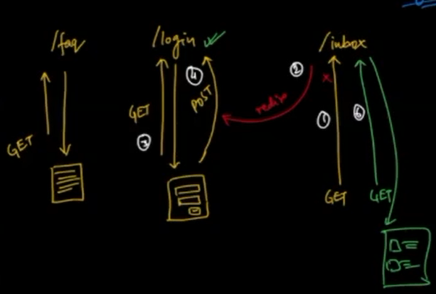
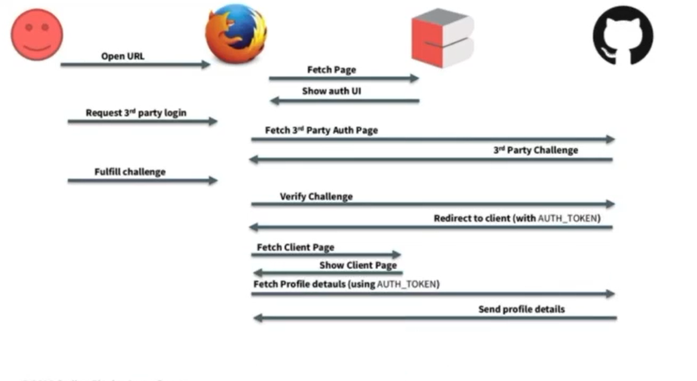
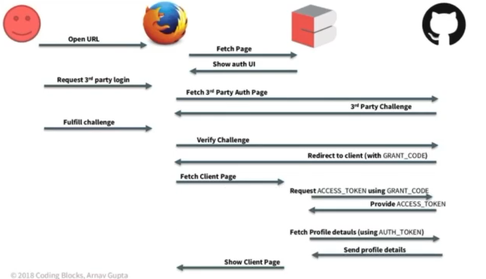
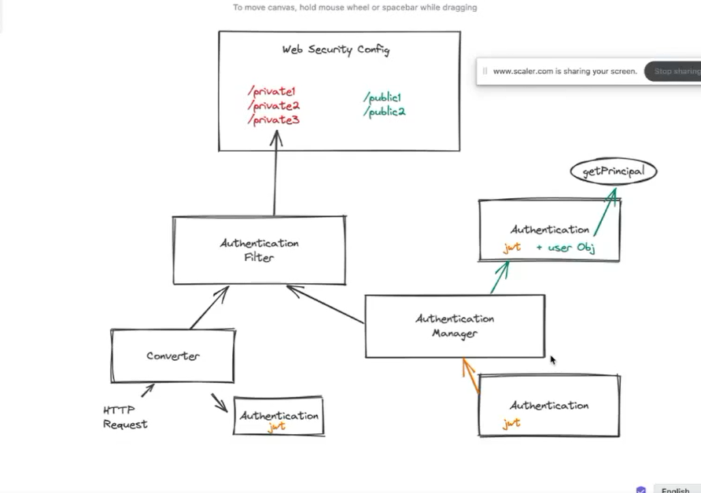

# Java-Basics-Scaler


## Why do companies have packages / groups name as opposite of domain  ? 

This is done to make folder hierarchy simple. This way you can easily identity which company has created what projects. For example, google can name its project package as 
1. com.google.android
2. com.google.mail
3. com.google.keep

This tells us that google has created android, mail and keep. In future, google can add more products easily using this structure. 

It is not necessary to have the domain registered for this naming convention. It's just a convention which people have been following.

## Gradle

Gradle is one of the build systems widely used for Java. 
- If you have gradle installed then you can run gradle build
- Every gradle project also has a gradlew folder which contains gradle script. This is useful in case you want to do CI / CD. You can run gradle without installing using gradlew build
- Gradle is better than maven decause you have better auto suggestion and you can write actual code instead of xml in the gradle file which makes it more powerful.

## How to run jar ?

```shell
java -jar <name-of-file>.jar
```

## OkHttp library

This library is used to make http calls in a java project.

## Creating a fat jar in Gradle

By default jar you build in gradle do not include imported libraries like OkHttp. You need to add the below line to include it into the jar :

```groovy
from {
        configurations.runtimeClasspath.collect { it.isDirectory() ? it : zipTree(it) }
    }
```

## Reflection API in Java

Reflection APIs in java allow you to access methods or other fields of an object without knowing the class of that object. You can also access private methods using reflection. Reflection is a runtime concept so which method to call is decided during runtime. 

Use-case 
- Reflection in used in unit testing for creating mocks
- Reflection is used in many libraries like serialization.

## Threads in Java

- Hardware threads vs software threads : every cpu has cores and threads fixed. These are hardware threads and these don't change.
- software threads are mapped to hardware threads for execution. Since software threads > hardware threads, time sharing happens between software threads. This is taken care by the scheduler.
- Hardware threads can actually run in parallel.
- Usually you have 2 threads per core. So a 4 core CPU will have 8 hardware threads.
- % CPU in task manager is the percentage utilization of 1 core in the last 5 seconds. So if a process is using more than 1 core, % CPU can go more than 100%.

### Use Case : you have to do a task on the end of a certain task.


What you need to do is that when a taskA ends, you need to then start taskB. This is a common usecase because there might be some tasks which are dependent on other tasks. You might want to execute them in order. To do this we can use the callback pattern.
- Create callback interface.
- inject the callback object using constructor or directly through the run method.
- then when calling the taskA, you specify what you want to do inside the callback.

```java
package com.scaler;

import java.util.concurrent.ArrayBlockingQueue;
import java.util.concurrent.ThreadPoolExecutor;
import java.util.concurrent.TimeUnit;

public class AsyncOperations {

    interface OnTaskEndListener {
        void onTaskEnd();
    }

    static class MockLongTask {
        private final String name;

        public MockLongTask(String name) {
            this.name = name;
        }

        void run(OnTaskEndListener listener) {
            new Thread(() -> {
                System.out.println("MockLongTask.run(" + name + ") started");
                var start = System.currentTimeMillis();
                // fake 10 sec delay
                // in real life, this would be a long running task
                while (System.currentTimeMillis() - start < 10000) {
                }
                System.out.println("MockLongTask.run(" + name + ") ended");
                if (listener != null) {
                    listener.onTaskEnd();
                }
            }).start();
        }

        void run() {
            run(null);
        }
    }

    public static void main(String[] args) {

        var taskA = new MockLongTask("1-download");
        var taskB = new MockLongTask("1-encrypt");
        var taskC = new MockLongTask("2-unrelated");

        taskA.run(() -> taskB.run()); // this is how to do something when some task has ended using callbacks.
        taskC.run();

        var executor = new ThreadPoolExecutor(
                1,
                4,
                5, TimeUnit.SECONDS,
                new ArrayBlockingQueue<>(10)
        );

    }
}
```

- Java doesn't provide this out of the box so you have to use callbacks. GoLang has better support for this as it has some good inhouse libraries.


### Thread executors 

Thread executor creates a pool of threads and uses those threads only to schedule tasks. For example, if you specify your thread executor to have 4 threads and pass 6 tasks to it, 2 tasks will be in the waiting state for any thread to pick them up.


## Web Frameworks

These frameworks are mostly MVC framework. 
- **Model** : Model is the data repository layer which contains the code to interact with database
- **View** : View is the layer which interacts with the front end. This contains controllers
- **Service** : This is the layer which is the middle layer and interacts with both Model and View. This contains the actually business logic.


# Spring Boot : Introduction, Project Structure and Controllers

Springboot is an extension of spring which makes developing applications in Java very easy. It offers annotation based configurations. It is a JAVA development framework.

## How to structure your projects 

**Package by layers** : You package the project based on layers

> This is used in legacy codebases.

controllers
- usercontroller
- listcontroller
- notescontroller

services
- userservice
- notesservice
- listservice

repositories
- userrepository
- notesrepository
- listrepository

**Package by features** : You package the project based on features. 
> This is done in modern projects because it is easy to create microservices out of the feature because all files related to that feature are inside one folder

users
 - usercontroller
 - userservice
 - userrepository


 ## Annotations in Spring 

 ```java
  @RestController // Use this annotation over all the controllers
  @RequestMapping // this is used to specify the base path for the controller
  @GetMapping // Specify get endpoint path
  @PathVariable // Specify query parameters to java variable mapping
  @Service // for service layer
  @Bean // put on a method which returns an object which you need to manage
 ```

 ## Serialization and Deserialization

 **Serialization** is the process of converting JAVA objects into some other form
 **Deserialization** is the process of converting data in some other form into JAVA objects.

 Why ? 
 Since we cannot transfer java objects through the network, we need to convert them to suitable forms like JSON, bytes etc.

 Examples 
 Jackson, GSON etc libraries offer serialization and deserialization

 ## DTOs

 DTOs are data transfer objects. Sometimes your data transfer object would need to have metadata like page number, count of tasks or any other information. In such scenarios, your actual model is wrapped by a DTO object to make things segregated.

 ```java
 // General dto syntax

 class TaskResponse {
    private int count;
    private List<Task> tasks;

 }
 ```

 ## REST

 Set of guidelines to create apis.


 ## CRUD

 |  Method |  /users | /users/id  |
|---|---|---|
| **GET**  | gets all users  <br> search ops also work via query : /users?name=Jatin | gets users whose id is 23   |
| **POST** | create a new user (note: the server will create the id of new user)  |  NA |
|  **PUT** | NA  | create a new user with id = 23, if users exists then override(note : only used if server lets client set the id of the user object)   |
| **PATCH** | NA | update the fields of the user with id = 23 (fields which are supplied int the request body are merged with the old fields. Same fields are overridden) |
| **DELETE** | NA | Delete user with id = 23|


### Difference between **PUT** and **PATCH**

Let's understand this with the help of an example : 

PUT - the entire old object is overridden by the request body of the PUT call
> If old object is not present, PUT creates the old object.

| old object | new object | result|
|------------|------------|-------|
| { firstname: "jatin", middlename: "kumar", lastname: "narula" } | {firstname: "jatin" ; lastname: "mehrotra"} | { firstname : "jatin"; lastname : "mehrotra" }|


PATCH - the new object is taken and merged with the old object. Same fields are only overridden
> PATCH may not work if old object is not present.

  | old object | new object | result|
|------------|------------|-------|
| { firstname: "jatin", middlename: "kumar", lastname: "narula" } | {firstname: "jatin" ; lastname: "mehrotra"} | { firstname: "jatin", middlename: "kumar", lastname: "mehrotra" } |


## Beans in java

Beans are java objects managed by springboot. Let's understand this with the help of an example. Suppose you want to inject TaskServiceImpl when environment is prod and TaskServiceTestImpl when environment is local. You can do this by creating a method inside @SpringbootApplication and annotating it with @Bean. Whatever object that method returns, spring will manage that and inject that when you need it at various places. 

```java
@SpringBootApplication
public class SimpleservermavenApplication {
	private static boolean isTestEnv = false;
	public static void main(String[] args) {
		if (args[0].equals("test")) {
			isTestEnv = true;
		}
		SpringApplication.run(SimpleservermavenApplication.class, args);
	}

	@Bean
	public TaskService taskService() {
		if (!isTestEnv) {
			return new TaskServiceImpl();
		} else {
			return new TaskServiceTestImpl();
		}
	}
}
```

> Note : Read about the step which take place during Spring boot bootstrap phase.


## Open API or Swagger

Open API or Swagger is an automatic documentation tool which creates documentation for your endpoints as soon as you code them in your controller. 

How to add swagger dependency ?

```xml
		<dependency>
			<groupId>org.springdoc</groupId>
			<artifactId>springdoc-openapi-ui</artifactId>
			<version>1.6.9</version>
		</dependency>
```

Open this url to view Swagger documentation : 

```
http://localhost:8081/swagger-ui/index.html
```

## Status Codes

Status code are an important part of coding APIs. You need to make sure you write the proper status codes. Proper status code makes coding on the client side easy and simple.

> Most client side libraries automatically handle the action based on status code. Hence it's important to obey the conventions


**200: SUCCESS** : When your call is successful and you have some data to return.
**201: CREATED** : When you create new items you should give 201.
**202: ACCEPTED** : When you updated something on the server you should send 202 : Accepted. This is usually done when you do a batch request or delete request.


## Using Springboot Web's ExceptionHandler

Springboot's exception handler lets you segregate the exception handling logic to a separate method and then in your controller you can code for the happy path. If any exception occurs during the api call, it will be routed to the exception handler

```java
    // Add this in your controller. 
    @ExceptionHandler(TaskService.TaskNotFoundException.class)
    public ResponseEntity<ErrorResponse> handleException(Exception ex) {
        return new ResponseEntity<>(new ErrorResponse(ex.getMessage()), HttpStatus.NOT_FOUND);
    }
```

## Different ways to fetch the same data 

```
1. api.sample.com/albums/1/photos

2. api.sample.com/photos?albumId=1
```

Although both of them return the same data, there is a subtle difference in where they are used. 

1. This is used when you have return all the results for a particular category. For example, all products of a seller on Amazon, Food as a category in Google photos.
2. This is used when there is a possible search category which users will be using. Eg. someone searching for a product in amazon, you searching for "food" photos in Google Photos. This kind of endpoint is usually used in filters. If you don't use this type of endpoint for filters, you would end up creating a lot of endpoints


## Databases

1. When you have a table's ID inside another table, that relationship cannot be many to many. It has be one to one (if the id is unique) or one to many(if the id is not unique).
2. Many to many relationships need a mapping table.

## JPA - Java Persistence API

JPA is a specification which takes care of persistence of Java objects.

Some features of JPA
1. JPA lets you avoid the need to think "relationally".
2. In JPA, you define your persistence rules in the realm of Java code.
3. Hibernate is an implementation of JPA. JPA is just a concept.

## H2 Database

H2 is a lightweight database used mainly for testing and small development activities. This database stores the data in-memory and hence it is not used in production. This can be embedded in the Java code or in a client server model.


## Some useful annotations related to databases in springboot

```java
@ManyToOne // specify many to one relationship
@Id // specify Id column
@GeneratedValue(strategy = GenerationType.SEQUENCE) // auto generate id value with sequence algorithm.
@JoinColumn(name = "task_id") // a way to represent foreign key relation in a table
@Entity(name = "note") // specify an entity model class for database
```

## Entity Classes

Entity classes are created to store data in the database. These are the dtos for interaction with the repositories

```java
@Getter
@Setter
@ToString
@RequiredArgsConstructor
@Entity(name = "note")
public class NoteEntity {
    @Id
    @GeneratedValue(strategy = GenerationType.SEQUENCE)
    @Column(name = "id", nullable = false)
    private Long id;

    @NonNull
    @Column
    private String text;

    @ManyToOne
    @JoinColumn(name = "task_id")
    private TaskEntity task;
}
```

## Creating repository layer

By default, you get some inbuild methods for the repository layer which you can easily use. You need to extend the JpaRepository interface for it.

```java
public interface TasksRepository extends JpaRepository<TaskEntity, Long>
```

## Working with databases

> You can use plugin Robopojo generator in Intellij to auto generate POJO from Jsons.

We use snake case for column names because some old databases are case insensitive hence camel case can cause problems
```java
    @ManyToOne
	@JoinColumn(name = "user_id")
	private UserEntity author;
```


## Naming conventions

```java
class ArticlesRepository {} // this is plural because it details with multiple articles
class ArticleEntity{} // this is singular because it represents a single Article 
```

## Unit Testing Repositories

The best practice to unit test a repository is to create a real in memory database like H2 and run tests over that rather than using something like mockito. This is because if you use mockito to mock the data, sometimes your unit test will pass but in production it will fail.

Try to write big tests rather than small ones because they don't server much purpose.

If you have done integration testing and it is successful, unit testing is not needed.


## JpaDataTest and SpringbootTest

JpaDataTest - each unit test will use a different instance of a DB so a user created in one test won't be available for other test. This gives you complete isolation

SpringBootTest - Use this with a profile. Profile helps you create a separate DB for testing purpose.


## Identification, Authentication and Authorization

**Identification** : The process of serve identifying a user as unique from others.


> When you search something on google without logging in, is it any different from your friend seaching on google without logging in ? 

> **Answer** : Under normal circumstances, you both would be treated as same. But in real scenario, as soon as you make the first request, Google embeds a cookie in your computer to identify that you you are a separate user from your friend. This way it can give related and better search results.

**Authentication** : When you want the server has already identified you and then it wants to resuse that identity. When the client(can be bot or human) want to identify itself again with ther server through some id, that process is called Authentication.
Authentication means you can make people prove that they are authentic using some id.


> **Difference between 401 and 403**

>401 is called unauthorized(the name in official documentation says this but actually it means unauthenticated) This happens when the API call expects a token which it can use for authentication but the caller doesn't sends the right token. Usually, in case of unauthorized we send the user to a login page.

> 403 is called forbidden. This happens when the user is authenticated but he or she doesn't have the necessary rights to view the data. For example, you try to login to some admin page but you don't have necessary privileges, then you will get 403.

> a logged in user can never get a 401 and a logged out user can never get a 403.


## Authentication via Authorization

**This is also called OAuth SSO visa social media accounts.**




Let's first understand some basics. There are three endpoints 

1. /faq : This is a public endpoint which doesn't need any authentication. So literally anyone can call it.
2. /login : this is a post endpoint where you enter your details and the server logs you in
3. /inbox : This is a private endpoint which only authenticated users can see.

What is the difference between call 1 and call 6 ? 
The difference is that call 6 has a token for authentication hence this call goes through. But now the question is how does the server know ? (servers are stateless, the request for login and inbox might have gone to different servers then how is the state maintained ?)

**Why are tokens used ?** 
 
 Tokens are used because we don't want the user to login again and again so it offers a secure way to avoiding relogin by the user.

 ### Token management

 There are two families of tokens
 1. Bearer Tokens or server side tokens.
 2. JWT token or encrypted tokens.

 **Bearer Token**

 This token is a random token with is stored on the server side. When a user "A" logs in, we give a token to this user. Now when a request comes to the server containing a bearer token, we take this token and see to which user it belong by querying the DB on the server side. From there we can identify that this token belongs to "A".

 We usually have a token table where we add / remove / soft delete tokens when a user logs in or logs out respectively.

 > If you login from three different devices, you will have 3 different token in db as rows. This is how website like Amazon and Facebook show you different logged in devices.

 **JWT Token or Signed Token**

 This token contains actual information. When the user "A" logs in, we use ther userid and encrypt it to create a token. Then when a request comes with the JWT token, we decrypt the token using cryptographic functions and get the userid to identify user "A". 


### What is JWT ? 

It is a token which is a combination of three parts: 
- meta data 
- payload
- signature

The meta data and payload are base 64 encoded. The signature is a combination of meta data and payload and is signed. It is then base 64 encoded.

The signature is done so that no one can change the payload.

How does the login flow work with JWT token ?  
1. The user first logs in 
2. You then use the username and generate the token using your token generation service.
3. This token is then signed using the signature key
4. The signed JWT token is then passed to the user and this user then uses this token for subsequent api calls.
5. When a new api call comes from the user with the JWT token, you take the header and the payload and sign it with the same key. If the data is same, it means that no one has altered the data and you are good.

> Never store private information like passwords and phone numbers in JWT token as they are visible in public.

When to use JWT and server side tokens ? 

- With JWT tokens, you cannot logout a user manually because JWT only have an expiry and they don't have a present in DB.
- Serve side tokens help you to logout a particular user because you can clear the entry for that user from the Token table and that user would be logged out.
Uses : 
- JWT tokens are used in server to server communication because you don't need to logout a user.
- gmail, fb both use server side token because they need to logout a user
- Sometimes both are used like when you sign in to account.google.com you get your server side token then on Youtube.com you authenticate using JWt token with a short expiry. When this token expires, Google automatically renews this JWT token using your account.google.com token. This is called 2 - tier authentication.
- JWT are stateless since they contain JSON data directly. There is no need to talk to the database hence latency is reduced in api calls with JWT authentication.

> Read more about JWT security [here](https://developer.okta.com/blog/2018/06/20/what-happens-if-your-jwt-is-stolen).

### How to secure JWT ? 

If you don't want your username to be visible to outside world, you can encrypt the JWT using AES and then add it in the payload. That way no one will be able to know the real username.

## How third party Login works ? (OAuth)

**Login via Github / Google / Facebook for Front-end only websites**

> Also called implicit, client only or 2 - legged flow

1. You click on "Login with Github button".
2. You are taken to Github's login page.
3. You enter your github credentials. Github verfies that the credentials are valid or not and it is coming from which Client Id. When you create your website, you will get a client id when you register your website with github for login.
4. After verification is successful, github sends you to the redirect URL(code 301) which you have configured and adds a auth_token. You then store this auth_token in your local storage of the browser and make subsequent requests with this auth token to fetch data like github username, github profile, blog pages etc.



**Login via Github / Google / Facebook for websites having servers**

> Also called explicit, 3 - legged or server side auth.

1. After verifying the password it again redirects it to the url you have configured but this time it doesn't add the auth_token. This time it adds something called grant_code.
2. This grand code exchange happens between server to server.
3. Now when your website gets the grant token, it then make a call to github with the grand code to get the auth token. github verifies the grant code and sends back the auth_token.
4. The exchange of auth token happens server to server.
5. This auth token will be saved on your server database for making calls.



> Note : If you don't want to do auth from your side, you have services like Auth Zero and Octa to do auth management for you (Auth as a service).


> Read this for understanding auth : [Click here](https://speakerdeck.com/championswimmer/authentication-done-right-consuming-and-serving-oauth2-dot-0)


## Authentication Using Springboot

[Click Here](https://github.com/championswimmer/Conduit_SpringBoot_Postgres)




## CORS and CSRF

Read from here : [Click Here](https://securityzines.com/zines/csrf.html)


